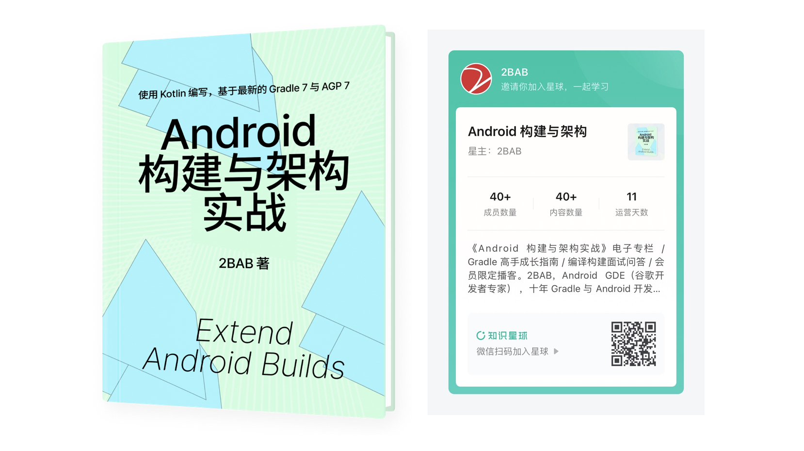
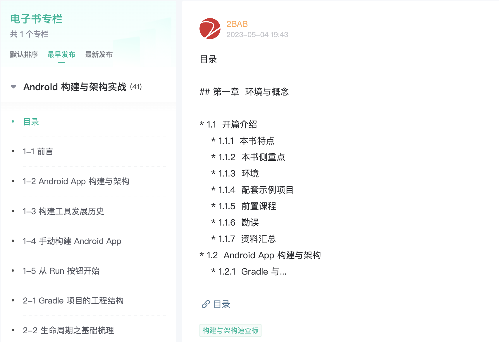

# 《Android 构建与架构实战》资料仓库

## 购买地址

[电子版](https://t.zsxq.com/0eF9jWLpY)：原价 ¥499，点击链接或扫描下面二维码购买，进入后请参考下图点击专栏阅读（推荐使用网页版获得最佳阅读体验）。本书目录见该[文档](./TOC.md)。

星球主营内容：

- 《Android 构建与架构实战》电子专栏：可能是市面上独一份（统计包括中英文）、系统性学习 Gradle 和 AGP 实战的书籍。随着 Android 的发展，封禁的系统 API 越来越多，Runtime 的黑科技已经越来越没得做，编译构建的工具却热度不减。
- 新知预告，不仅是英文社区的一手 Android 架构方面资料，还包括作为 GDE 参与到各个会议、与行业专家交流等了解到的前沿资讯。
- 会员播客，包括软技能分享、行业观察、职场思考、海外的互联网公司发展等。
- 问答：技术问题包括 AGP、Gradle、Android 架构、Kotlin 编译器等我和嘉宾探索的领域，均可提供一定的帮助；软实力和职业发展方向的问题亦可提供指引。

更多关于作者的信息，请访问我的[个人博客](https://2bab.me/zh/)。

## 前序学习资料

- [《KOGE》](https://koge.2bab.me/#/zh-cn/) 小册（已开源），前置学习资料：KOGE 是 Kotlin-oriented Gradle Essentials 的缩写，顾名思义是面向 Kotlin 的 Gradle 基础手册。我们按照合理的先后顺序，列出新手最困惑的概念，再从一些互联网上已有的问题、源码、示例项目中去学习。它不是 “Awesome Gradle” 的项目收藏夹，而是一份大纲，一本简练的自学手册。手册选择了 Kotlin 作为介绍 DSL 脚本和插件开发的语言，链接和用例以 Android 构建场景为主。Gradle Kotlin DSL 在 IDE 中的补全支持优秀，Kotlin 的生态活跃，作为 Android 开发者的我也十分享受一门语言带来的统一体验（App 主体开发和构建工具开发）。对于其他平台的 Gradle 使用者，也可以沿袭同样的脉络进行学习。

## 配套代码

- [Playground](./Playground/) ：本书配套示例代码。
- [Polyfill](https://github.com/2BAB/Polyfill)：本书使用到的开源项目，构建了一套与 AGP Artifact API 风格一致的第三方工件仓库。
- [BundleTool Gradle Plugin](https://github.com/2BAB/bundle-tool-gradle-plugin)：本书使用到的开源项目，自动化 BundleTool 执行的 Gradle 插件，包括 `.apks` 的生成、测试、安装、上传等后续操作。
- [ScratchPaper](https://github.com/2BAB/ScratchPaper)：本书使用到的开源项目，一款图片资源相关的 Gradle 插件，用来给 APK 图标添加 variant/version/git-commit-id 等信息以区分不同版本，由全新的 Variant/Artifact API 和 Polyfill 框架驱动。
- [Koncat](https://github.com/2BAB/Koncat)：本书使用到的开源项目，基于 KSP，不需要反射或字节码修改，即可在编译期的源码阶段实现多模块的标记收集，路由表生成等，例如获取一个应用里某个接口的所有实现。
- [Caliper](https://github.com/2BAB/Caliper)：本书使用到的开源项目，Android 敏感权限和 API 调用的监控和控制器，基于 AGP 新版字节码转换 API。
- [Detekt](https://github.com/detekt/detekt)：Kotlin 静态代码检查工具。
- [Kotlin-Code-Analyzer](https://github.com/bennyhuo/kotlin-code-analyzer)：Kotlin 原生静态检查 API 封装工具。

## 更多参考资料

- [附录 - 常用缩写/常用翻译](./Common-Abbreviation-Translation.md)
- [本书各节参考资料](./reference_per_section.md)
- [Gradle 插件收藏夹](https://github.com/stars/2BAB/lists/gradle-plugins)

## 导读

## FAQ

### 1. 在知识星球购买后，我需要每年续费吗？不续费还看得到吗？

知识星球到期后**可以继续阅读**的，和其他地方购买在线电子书的体验一致。只是不再获得后续的更新或参与星球讨论。

请参考知识星球的[常见问题](https://help.zsxq.com/howto/faq/user#xing-qiu-dao-qi-hou-hai-neng-bu-neng-cha-kan-zhi-qian-de-nei-rong)说明，只要不出现违法行为被平台踢出或主动点击退出/删除，均可**永久获得你所购买时间内该星球的内容**。

### 2. 本书会有纸质版吗？

因为出版社对小众选题很谨慎（一般首印最低 3000 本），今年形式不好他们表达了很多担忧。所以我目前没有拿到出版合同。

### 3. 后续还会更新吗？

对于《Android 构建与架构实战》主体内容，采用的是跳级更新的形式，例如当前版本为 AGP 7 为主 + 部分 8 的内容前瞻（即 Alpha/Beta 版本）。下次大版本更新为 AGP 9 为主 + 部分 10 的前瞻。因此，中间仅会出现极少的小版本断档。

采用这个模式的原因是 AGP 的更新较为谨慎，在改成跟进 Gradle 的版本更新（即从 4.2 跳 7.0）之后，一般不会出现突然连续两个大版本有大量 Breaking Changes。例如 AGP 7 在 2022 年预告了 8 会有很多 API 被删除，而 8 目前**没有**预告 9 会有很多 API 被删除。**这个模式的更新可以系统性回顾过去、给出一点未来的开发方向预测，让读者更全面的了解变更背后的原因，而不是一味追新不知所以，是应对 AGP API 变化的一个有效策略**。

对于日常的 Gradle 和 AGP 新功能，将采用星球的常规内容发布作为更新渠道，并打上对应的标签（新知预告 或 Gradle&AGP），方便大家系统性阅读更新。

最后对于错误的订正包括文字说明不清楚、代码有 bug 等问题，会及时修复更新。

### 4. 到底是卖书还是卖星球？

本 FAQ 写于 2023 年，此时媒介发展的多元性已经超出我们的想象，就如同未来我们与 app 交互可能是 AI 对话框一样——我目前只能说这是一个混合模式。如果按照内容重点划分，70% 是电子书，15% 是新知预告，15% 是问答和会员播客。

知识星球对素人申请很友好，支持内容的长期动态更新，是我选择的原因之一。

## 勘误

如果读者在文本和代码中发现错误，希望能帮忙提交建议与勘误。请直接访问本仓库的 issues 页卡，按照 issue template 的提示提交勘误（文本和代码的勘误均相同）。一方面能减少其他读者的困惑，另一方面也帮助我提高后续版本的输出质量。在此，由衷地感谢每一位购买和阅读本书的读者。

